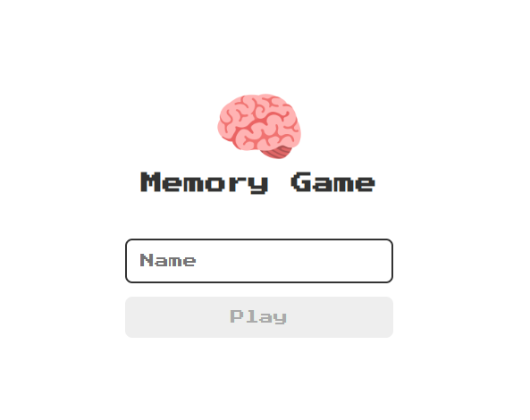
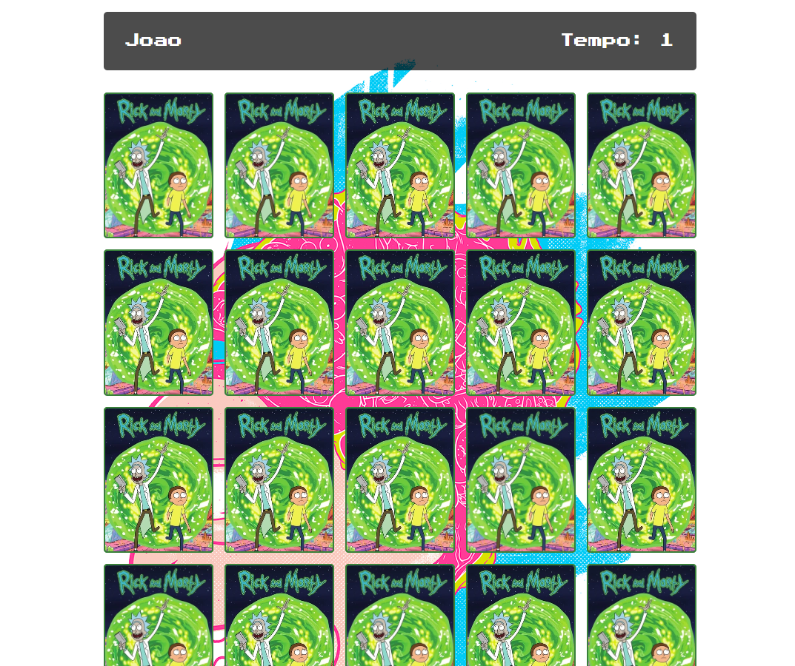
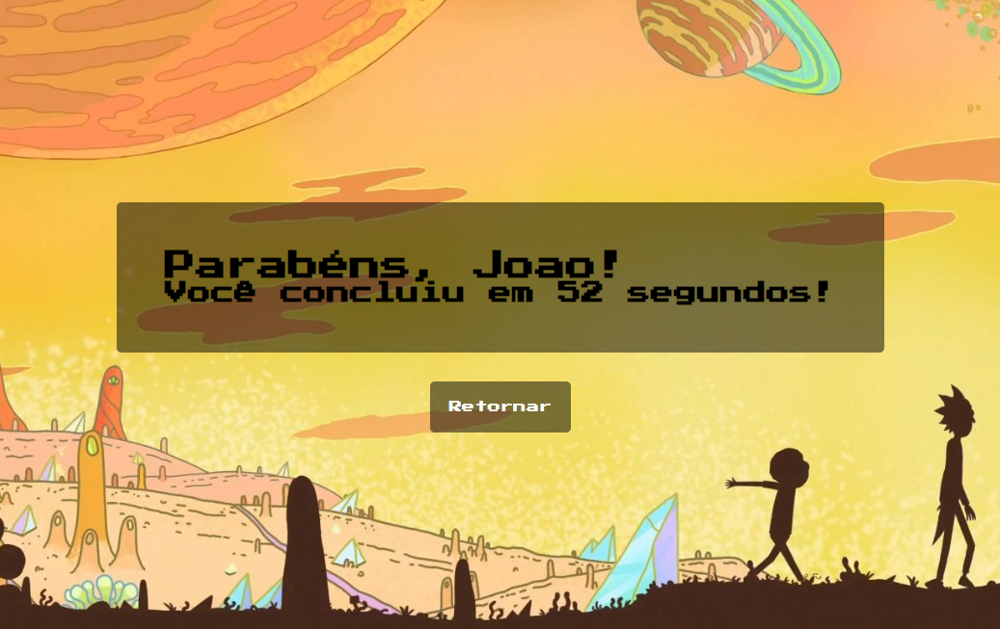

# Memory Card with Rick and Morty


## Sobre o projeto

O projeto foi desenvolvido para testar meus conhecimentos em HTML, CSS e JavaScript, e ao mesmo tempo me divertir, por se tratar de um jogo da memória. O jogo foi construido com imagens de um dos seriados mais famosos, chamado Rick and Morty

## Página de Login



Basta colocar o seu nome e apertar o play, para o butom ser habilitado, é necessário escrever um nome com o mínimo de 3 caracteres.

## Página do Game



A página do jogo é bem simples de entender também, a partir do momento que for clicado em alguma dessas cartas, ela irá virar, e assim que juntar um dupla de cartas iguais, ela não virará mais e ficará cinzado, para o usuário entender que ele conseguiu.

## Página da vitória



Assim que conseguir achar todos os pares, o usuário será direcionado para a tela de vitória, com o nome do usuário colocado no login e os segundos que o usuário precisou utilizar. Logo abaixo terá um botão escrito "Retornar", assim que clicado, o usuário será direcionado a tela de Login!

## Tecnologias

- HTML
- CSS
- JavaScript

## Como rodar o código

```bash
# Primeiro vai ser necessário clonar o repositório
$ git clone https://github.com/JoaoAlves20/memory-card.git

# Depois basta entrar na pasta da clonagem
$ cd memory-card
```

Após isso é só abrir o HTML (pelo navegador direto ou através do Live Server), e já será possível visualizar o resultado desse código, no futuro irei tentar criar esse mesmo jogo em ReactJS.